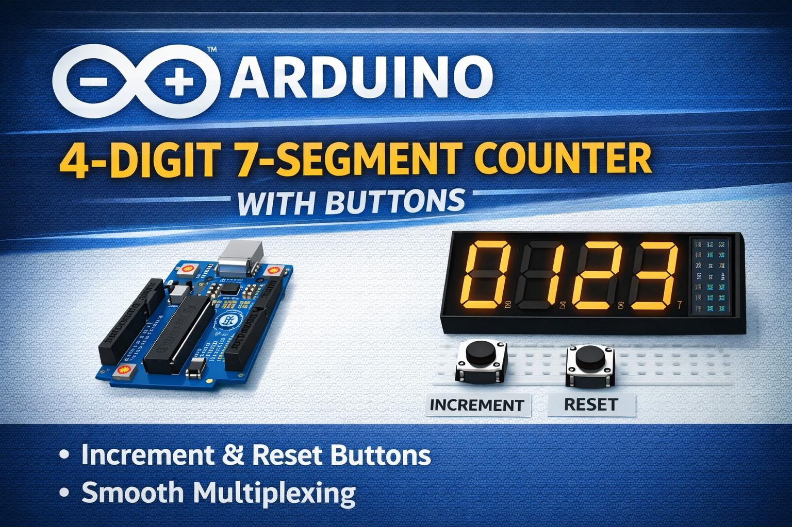

# Arduino 4-Digit 7-Segment Counter
<p align="center">
  
</p>

### Multiplexed Display with Increment and Reset Buttons

A smooth **multiplexed 4-digit 7-segment counter** built with an Arduino Uno and a **SH5461AS common-cathode display**.

The display refresh is handled with **non-blocking timing** using `micros()` and `millis()`, producing a flicker-free output while allowing responsive button input.

---

# Project Overview

This project demonstrates how to:

* Drive a **4-digit multiplexed 7-segment display**
* Use **NPN transistors to switch digit commons**
* Implement **debounced button input**
* Avoid blocking delays using **non-blocking timing**
* Write reusable embedded C++ code structures

The counter increments with a button and resets to `0000` with a second button.

---

# Hardware

## Components

* Arduino Uno / Nano
* SH5461AS **4-digit 7-segment display (common cathode)**
* 4 × NPN transistors (2N2222 or similar)
* 7 × 470Ω resistors (segment current limiting)
* 4 × 4.7kΩ resistors (transistor base resistors)
* 2 × push buttons
* breadboard + jumper wires

---

# Display Pinout

Display used:

**SH5461AS — common cathode**

Segments are shared across digits while each digit has its own cathode.

Digit cathodes are switched using **NPN transistors**.

---

# Arduino Pin Mapping

| Display Pin | Segment   | Arduino Pin |
| ----------- | --------- | ----------- |
| 1           | Segment E | D6          |
| 2           | Segment D | D5          |
| 3           | DP        | D13         |
| 4           | Segment C | D4          |
| 5           | Segment G | D8          |
| 7           | Segment B | D3          |
| 10          | Segment F | D7          |
| 11          | Segment A | D2          |

---

# Digit Control (via NPN transistors)

| Digit   | Arduino Pin | Transistor |
| ------- | ----------- | ---------- |
| Digit 1 | D12         | Q1         |
| Digit 2 | D11         | Q2         |
| Digit 3 | D10         | Q3         |
| Digit 4 | D9          | Q4         |

Each transistor sinks current from the digit's common cathode.

---

# Button Wiring

Internal pull-ups are used.

| Function  | Arduino Pin | Connection   |
| --------- | ----------- | ------------ |
| Increment | A0          | Button → GND |
| Reset     | A1          | Button → GND |

State logic:

| Pin State | Meaning     |
| --------- | ----------- |
| HIGH      | Not pressed |
| LOW       | Pressed     |

Reference:
https://www.arduino.cc/reference/en/language/functions/digital-io/pinmode/

---

# Multiplexing Principle

Only **one digit is active at a time**.

The system rapidly cycles through the digits:

```
Digit1 → Digit2 → Digit3 → Digit4 → repeat
```

Refresh timing:

```
2 ms per digit
≈ 125 Hz total refresh
```

This speed makes the display appear continuously lit due to **persistence of vision**.

Reference:
https://learn.sparkfun.com/tutorials/7-segment-display/all

---

# Digit Extraction

The integer value `n` is split into individual digits.

```cpp
thousands = (n / 1000) % 10
hundreds  = (n / 100)  % 10
tens      = (n / 10)   % 10
ones      = n % 10
```

Reference:
https://en.wikipedia.org/wiki/Modulo_operation

---

# Button Debouncing

Mechanical switches bounce electrically when pressed.

A debounce filter ensures that **one press = one increment**.

Reference:
https://docs.arduino.cc/built-in-examples/digital/Debounce/

---

# Important Compiler Fix

Some Arduino toolchains do not allow initializing the struct like this:

```
DebouncedButton btnInc {incPin};
```

This causes the error:

```
no matching function for call to DebouncedButton(...)
```

The solution is to add a **constructor** and initialize using parentheses.

```
DebouncedButton btnInc(incPin);
DebouncedButton btnReset(resetPin);
```

---

# Full Arduino Code

```cpp
#define DIGIT_ON_US 2000
#define DEBOUNCE_MS 25

const byte pDigit[4]   = {12,11,10,9};
const byte pSegment[7] = {2,3,4,5,6,7,8};

const byte numbers[10] = {
B0111111,B0000110,B1011011,B1001111,B1100110,
B1101101,B1111101,B0000111,B1111111,B1101111
};

const byte incPin=A0;
const byte resetPin=A1;

int n=0;
byte dig[4]={0,0,0,0};
// ---- Button (debounced edge detect) ----
struct DebouncedButton {
  byte pin;
  bool lastReading = HIGH;
  bool stableState = HIGH;
  unsigned long lastChangeMs = 0;

  void begin() const { pinMode(pin, INPUT_PULLUP); }

  // returns true exactly once when the button is pressed (HIGH->LOW)
  bool pressed(unsigned long nowMs) {
    bool reading = digitalRead(pin);

    if (reading != lastReading) {
      lastChangeMs = nowMs;
      lastReading = reading;
    }

    if ((nowMs - lastChangeMs) >= DEBOUNCE_MS && reading != stableState) {
      stableState = reading;
      if (stableState == LOW) return true;
    }
    return false;
  }
};

DebouncedButton btnInc  ;
DebouncedButton btnReset ;

inline void updateDigitsFromN(){

dig[0]=(n/1000)%10;
dig[1]=(n/100)%10;
dig[2]=(n/10)%10;
dig[3]=n%10;

}

inline void disableAllDigits(){
for(byte i=0;i<4;i++)
digitalWrite(pDigit[i],LOW);
}

inline void enableDigit(byte index){
digitalWrite(pDigit[index],HIGH);
}

inline void setSegments(byte num){

byte mask=numbers[num];

for(byte s=0;s<7;s++)
digitalWrite(pSegment[s],(mask>>s)&1);

}

void setup(){
btnInc.pin = incPin;
btnReset.pin = resetPin;
for(byte i=2;i<=13;i++)
pinMode(i,OUTPUT);

btnInc.begin();
btnReset.begin();

disableAllDigits();
updateDigitsFromN();
}

void loop(){

unsigned long nowMs=millis();

if(btnInc.pressed(nowMs)){
n++;
if(n>9999)n=0;
updateDigitsFromN();
}

if(btnReset.pressed(nowMs)){
n=0;
updateDigitsFromN();
}

static unsigned long lastMux=0;
static byte activeDigit=0;

unsigned long nowUs=micros();

if(nowUs-lastMux>=DIGIT_ON_US){

lastMux=nowUs;

activeDigit=(activeDigit+1)&0x03;

disableAllDigits();
setSegments(dig[activeDigit]);
enableDigit(activeDigit);

}
}
```

---

# Example Output

```
0000
0001
0002
...
9999
```

Reset button immediately returns the display to:

```
0000
```

---

# Possible Improvements

Future upgrades:

* decrement button
* long-press auto increment
* brightness control using PWM
* leading-zero suppression
* decimal-point support
* shift-register driver (74HC595) to reduce pins

---

# Repository Structure

```
arduino-7segment-counter/
│
├── README.md
├── src/
    ├── compact_counter.ino
│   └── counter.ino
└── images/
    ├── 7segmantWiring.png
    ├── display_pinout.png
    ├── resistorPinout.png
    └── wiringtable.jpg
```

---

# Learning Outcomes

This project demonstrates key embedded-systems concepts:

* multiplexed display driving
* transistor switching
* non-blocking timing
* button debouncing
* reusable embedded code patterns
# Helping Resource 
https://elektro.turanis.de/html/prj452/index.html
